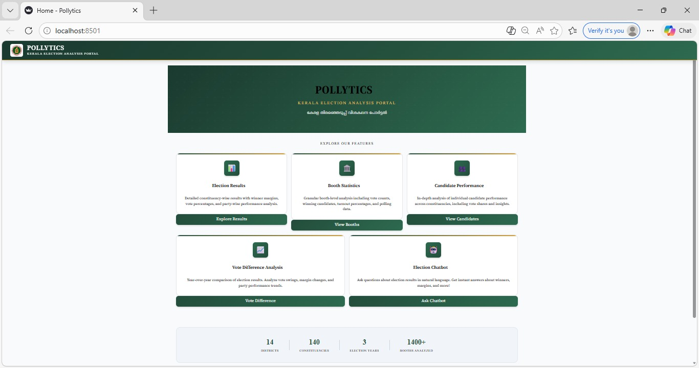
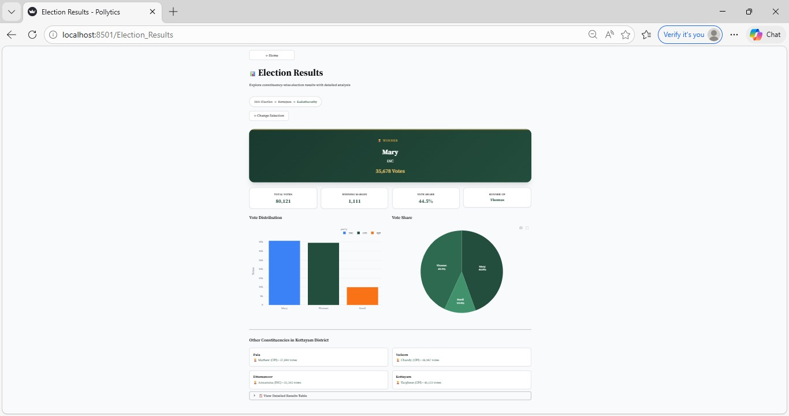
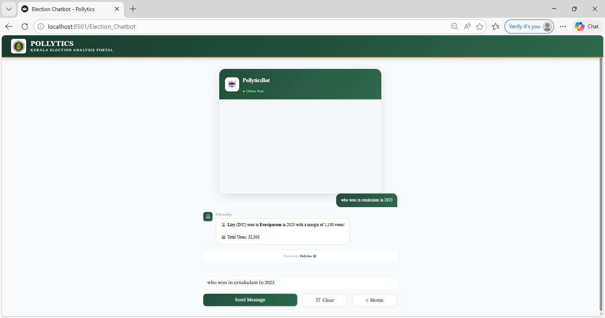

<p align="center">
  
</p>

# [POLLYTICS] 🎯

## Basic Details

### Team Name: [Checkmate]

### Team Members
- Member 1: [Sona Elizabeth Abraham] - [CUSAT]
- Member 2: [Siva Nanda C.P] - [CUSAT]

### Hosted Project Link
[https://pollytics-ezzwpsby9lapeqyx9kaw6x.streamlit.app/]

### Project Description
[POLLYTICS is a comprehensive Kerala Election Analytics Portal that transforms complex election data into interactive visualizations, enabling citizens to explore constituency-wise results, booth-level statistics, and voting patterns with ease.]

### The Problem statement
[Election datas are scattered and lacks an interactive platform for easy public exploration.]

### The Solution
[POLLYTICS transforms complex election data into an interactive web portal for citizens to explore results, compare trends, and gain insights effortlessly.]

---

## Technical Details

### Technologies/Components Used

**For Software:**
- Languages used: [Python]
- Frameworks used: [Streamlit]
- Libraries used: [pandas]
- Tools used: [VS Code, Git]

**For Hardware:**
- Main components: [Nil]
- Specifications: [Nil]
- Tools required: [Nil]

---

## Features

List the key features of your project:
- Feature 1: [Election results and analysis:Comprehensive constituency-wise    analysis displaying winner margins, vote percentages, and party performance across different districtsof kerala. Users can filter by year and location to access detailed election outcomes with interactive charts and visualizations. ]
- Feature 2: [Booth &candidate performance:Granular booth-level statistics including voter turnout, polling details, and winning candidates combined with in-depth candidate performance analysis. Track how candidates performed across different booths and constituencies with comparative metrics and vote share breakdowns.]
- Feature 3: [vote comparison:Compare election results between different years to identify voting trends, shifts in party dominance, and constituency-level changes. Visual representations highlight vote gains/losses for parties and candidates with margin analysis and close contest detection.]
- Feature 4: [AI chatbot:Intelligent conversational interface that answers user queries about election data in real-time, from winner details to booth statistics.]

---

## Implementation

### For Software:

#### Installation
```bash
[pip install streamlit pandas numpy plotly]
```

#### Run
```bash
[ streamlit run app.py]
```

### For Hardware:

#### Components Required
[Nil]

#### Circuit Setup
[Nil]

---

## Project Documentation

### For Software:

#### Screenshots (Add at least 3)


  
*home page showing all the features of the web*


*page showing election result*


*page showing chatbot*


#### Diagrams

**System Architecture:**


*The POLLYTICS system follows a simple architecture where users interact with a Streamlit-based web interface. The frontend collects user input such as election year or constituency and sends it to the Python backend. The backend processes election datasets using Pandas for filtering, aggregation, and analysis. The processed results are then displayed through interactive charts and visualizations. Data is stored in CSV files, making the system lightweight and efficient. The overall flow is: User → Streamlit Interface → Python Backend → Data Processing → Visualization Output.*

**Application Workflow:**


*The application follows a structured workflow to provide election insights. First, the user opens the POLLYTICS web portal and selects the required election data or analysis type. The system retrieves the relevant dataset and processes it using Python. The processed data is analyzed to identify voting trends, candidate performance, and election results. The results are displayed through interactive dashboards and visualizations, and users can further explore data or interact with the chatbot for additional information.*

---

### For Hardware:

#### Schematic & Circuit


*Add caption explaining connections*


*Add caption explaining the schematic*

#### Build Photos


*List out all components shown*


*Explain the build steps*


(Add photo of final product here)
*home page showing all the feature including election result,comparison booth statistics and chatbot*

---

## Additional Documentation

### For Web Projects with Backend:

#### API Documentation

**Base URL:** `https://api.yourproject.com`

##### Endpoints

**GET /api/endpoint**
- **Description:** [What it does]
- **Parameters:**
  - `param1` (string): [Description]
  - `param2` (integer): [Description]
- **Response:**
```json
{
  "status": "success",
  "data": {}
}
```

**POST /api/endpoint**
- **Description:** [What it does]
- **Request Body:**
```json
{
  "field1": "value1",
  "field2": "value2"
}
```
- **Response:**
```json
{
  "status": "success",
  "message": "Operation completed"
}
```

[Add more endpoints as needed...]

---

### For Mobile Apps:

#### App Flow Diagram


*Explain the user flow through your application*

#### Installation Guide

**For Android (APK):**
1. Download the APK from [Release Link]
2. Enable "Install from Unknown Sources" in your device settings:
   - Go to Settings > Security
   - Enable "Unknown Sources"
3. Open the downloaded APK file
4. Follow the installation prompts
5. Open the app and enjoy!

**For iOS (IPA) - TestFlight:**
1. Download TestFlight from the App Store
2. Open this TestFlight link: [Your TestFlight Link]
3. Click "Install" or "Accept"
4. Wait for the app to install
5. Open the app from your home screen

**Building from Source:**
```bash
# For Android
flutter build apk
# or
./gradlew assembleDebug

# For iOS
flutter build ios
# or
xcodebuild -workspace App.xcworkspace -scheme App -configuration Debug
```

---

### For Hardware Projects:

#### Bill of Materials (BOM)

| Component | Quantity | Specifications | Price | Link/Source |
|-----------|----------|----------------|-------|-------------|
| Arduino Uno | 1 | ATmega328P, 16MHz | ₹450 | [Link] |
| LED | 5 | Red, 5mm, 20mA | ₹5 each | [Link] |
| Resistor | 5 | 220Ω, 1/4W | ₹1 each | [Link] |
| Breadboard | 1 | 830 points | ₹100 | [Link] |
| Jumper Wires | 20 | Male-to-Male | ₹50 | [Link] |
| [Add more...] | | | | |

**Total Estimated Cost:** ₹[Amount]

#### Assembly Instructions

**Step 1: Prepare Components**
1. Gather all components listed in the BOM
2. Check component specifications
3. Prepare your workspace

*Caption: All components laid out*

**Step 2: Build the Power Supply**
1. Connect the power rails on the breadboard
2. Connect Arduino 5V to breadboard positive rail
3. Connect Arduino GND to breadboard negative rail

*Caption: Power connections completed*

**Step 3: Add Components**
1. Place LEDs on breadboard
2. Connect resistors in series with LEDs
3. Connect LED cathodes to GND
4. Connect LED anodes to Arduino digital pins (2-6)

*Caption: LED circuit assembled*

**Step 4: [Continue for all steps...]**

**Final Assembly:**

*Caption: Completed project ready for testing*

---

### For Scripts/CLI Tools:

#### Command Reference

**Basic Usage:**
```bash
python script.py [options] [arguments]
```

**Available Commands:**
- `command1 [args]` - Description of what command1 does
- `command2 [args]` - Description of what command2 does
- `command3 [args]` - Description of what command3 does

**Options:**
- `-h, --help` - Show help message and exit
- `-v, --verbose` - Enable verbose output
- `-o, --output FILE` - Specify output file path
- `-c, --config FILE` - Specify configuration file
- `--version` - Show version information

**Examples:**

```bash
# Example 1: Basic usage
python script.py input.txt

# Example 2: With verbose output
python script.py -v input.txt

# Example 3: Specify output file
python script.py -o output.txt input.txt

# Example 4: Using configuration
python script.py -c config.json --verbose input.txt
```

#### Demo Output

**Example 1: Basic Processing**

**Input:**
```
This is a sample input file
with multiple lines of text
for demonstration purposes
```

**Command:**
```bash
python script.py sample.txt
```

**Output:**
```
Processing: sample.txt
Lines processed: 3
Characters counted: 86
Status: Success
Output saved to: output.txt
```

**Example 2: Advanced Usage**

**Input:**
```json
{
  "name": "test",
  "value": 123
}
```

**Command:**
```bash
python script.py -v --format json data.json
```

**Output:**
```
[VERBOSE] Loading configuration...
[VERBOSE] Parsing JSON input...
[VERBOSE] Processing data...
{
  "status": "success",
  "processed": true,
  "result": {
    "name": "test",
    "value": 123,
    "timestamp": "2024-02-07T10:30:00"
  }
}
[VERBOSE] Operation completed in 0.23s
```

---

## Project Demo

### Video
[https://drive.google.com/drive/folders/1ZQHbKMPyCfffUfHwn6CQEmsJqhv8zHIj?usp=sharing]

*explains the working by navigating through all the features,showing results to chatbot answering*

### Additional Demos
[Add any extra demo materials/links - Live site, APK download, online demo, etc.]

---

## AI Tools Used (Optional - For Transparency Bonus)

If you used AI tools during development, document them here for transparency:

**Tool Used:** [ChatGPT, DeepSeek]

**Purpose:** [What you used it for]
- ChatGPT: "debugging and documentation assistance"
- GitHub Copilot: "code suggestions"


**Key Prompts Used:**
- "Create a REST API endpoint for user authentication"
- "Debug this async function that's causing race conditions"
- "Optimize this database query for better performance"

**Percentage of AI-generated code:** [Approximately X%]

**Human Contributions:**
- Architecture design and planning
- Custom business logic implementation
- Integration and testing
- UI/UX design decisions

*Note: Proper documentation of AI usage demonstrates transparency and earns bonus points in evaluation!*

---

## Team Contributions

- [Sona Elizabeth Abraham]: [Frontend development]
- [Siva Nanda CP]: [Frontend development]

---

## License

This project is licensed under the [MIT License] License - see the [LICENSE](License) file for details.

**Common License Options:**
- MIT License (Permissive, widely used)
- Apache 2.0 (Permissive with patent grant)
- GPL v3 (Copyleft, requires derivative works to be open source)

---

Made with ❤️ at TinkerHub
